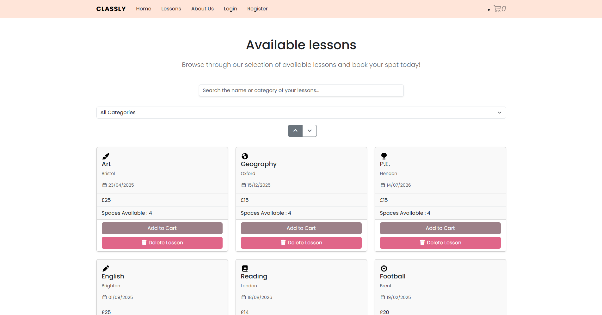

# After-School Activities Booking Site — Frontend

Frontend for a full-stack booking platform that lets parents/students browse and book after-school activities. Built as a team project at Middlesex University.

🔗 **Backend repo:** [FullStackCourseWork-Backend](https://github.com/BenjaminZadorian/FullStackCourseWork-Backend)
🔗 **Live demo:** [https://fullstackcoursework-backend.onrender.com]



---

## Overview

This is the client application for the booking platform, built with Vue.js. It communicates with the [Node.js backend](https://github.com/BenjaminZadorian/FullStackCourseWork-Backend) to display activities and manage bookings.

## Tech Stack

- **Framework:** Vue.js
- **Styling:** Bootstrap
- **HTTP client:** fetch
- **Hosting:** Render.com

## Features

- Browse and filter available activities
- User registration/login
- Book and view upcoming bookings
- Responsive layout for mobile/desktop


## Getting Started

### Prerequisites
- Node.js (v23+)
- The [backend API](https://github.com/BenjaminZadorian/FullStackCourseWork-Backend) running (locally or deployed)

### Installation

```bash
git clone https://github.com/BenjaminZadorian/FullStackCourseWork-Frontend.git
cd FullStackCourseWork-Frontend
npm install
npm run build
```

## Deployment

Deployed on [Render.com](https://render.com).
